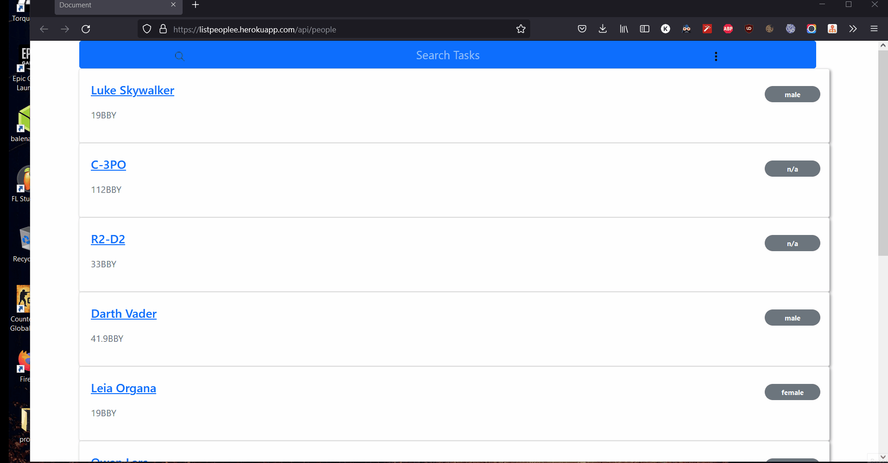
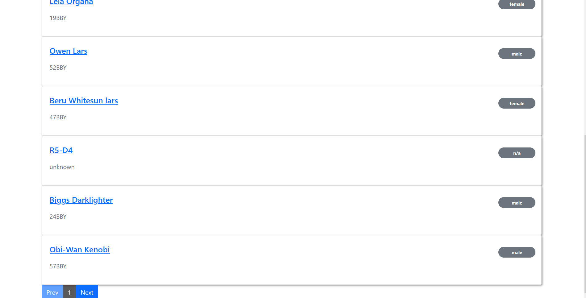
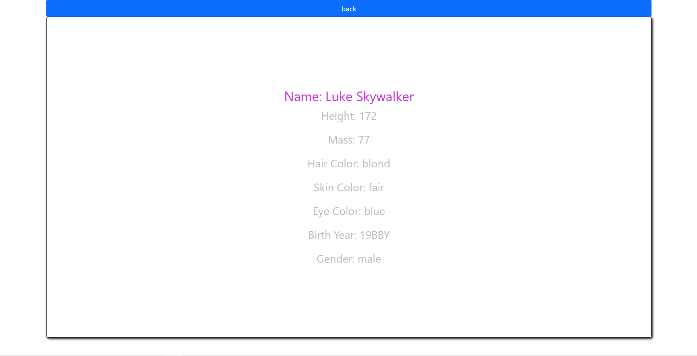
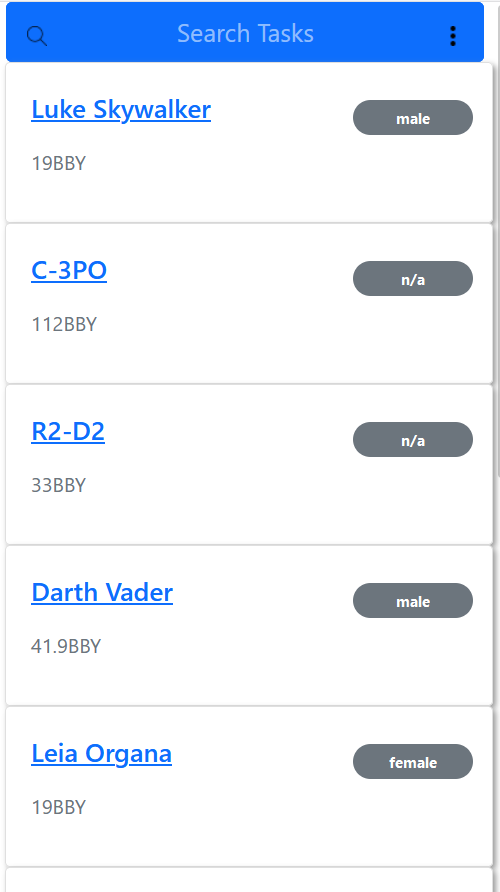
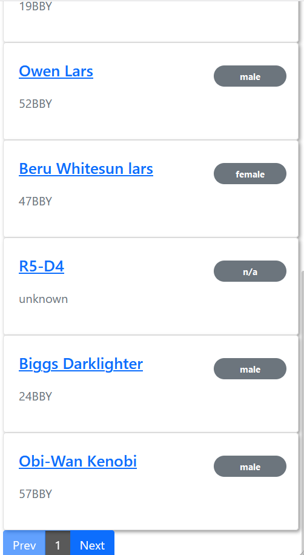

## Installation

- Run the following commands in the terminal

```bash
git clone https://github.com/Kaphleamrit/listPeopleApp.git
cd listPeopleApp
npm install
npm start
```
## GIF



<!-- ## Screenshots




   -->


## Deployment

[ListPeopleApp](https://listpeoplee.herokuapp.com/api/people)

## Contributing

Pull requests are welcome. For major changes, please open an issue first to discuss what you would like to change.

Please make sure to update tests as appropriate.

## License

[MIT](https://choosealicense.com/licenses/mit/)
