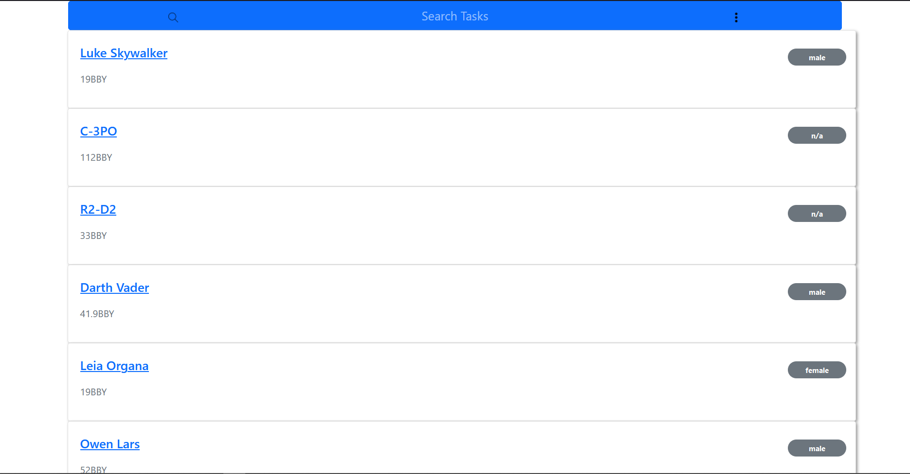

# Hybrowlabs Technologies

## Assignment for ReactJS

## Installation

- open your terminal and do

```bash
git clone https://github.com/Kaphleamrit/listPeopleApp.git
```

- after cloning type

```bash
cd listPeopleApp
npm install
```
## GIF


## Screenshots



  


## Deployment

[ListPeopleApp](https://listpeoplee.herokuapp.com/api/people)

## Contributing

Pull requests are welcome. For major changes, please open an issue first to discuss what you would like to change.

Please make sure to update tests as appropriate.

## License

[MIT](https://choosealicense.com/licenses/mit/)
